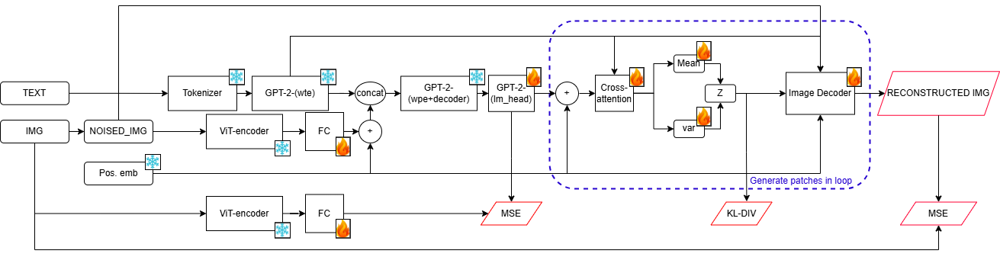

# Генерация изображений с использованием GPT-2 + ViT (Omni-GPT2o)

Этот проект реализует исследовательский подход к генерации изображений с использованием моделей GPT-2 и ViT (Vision Transformer), вдохновленный последними разработками в области нативных возможностей генерации изображений для языковых моделей.


### Архитектура



## Структура проекта

```
.
├── src/
│   ├── model.py      # Основная архитектура модели
│   └── train.py      # Скрипт обучения
├── utils/
│   ├── preprocess.py           # Утилиты предварительной обработки данных
│   ├── extract_descriptions.py # Скрипт для извлечения описаний из COCO
│   └── noise.py                # Функции для генерации шума
├── data/             # Директория для датасета
├── models/           # Сохраненные чекпоинты моделей
├── logs/             # Логи обучения и визуализации
├── generate_sample.py # Скрипт для генерации примеров
└── requirements.txt  # Зависимости проекта
```

## Настройка

1. Установите зависимости:
```bash
python -m venv venv
source venv/bin/activate  # На Linux/Mac
# или
venv\Scripts\activate     # На Windows
pip install -r requirements.txt
```

2. Загрузите и подготовьте датасет:

### Загрузка датасета COCO
```bash
# Создаем директории для данных
mkdir -p data/prepared_dataset/train2017/images
mkdir -p data/prepared_dataset/val2017/images

# Загружаем аннотации и изображения COCO
wget http://images.cocodataset.org/annotations/annotations_trainval2017.zip -P data/
wget http://images.cocodataset.org/zips/train2017.zip -P data/
wget http://images.cocodataset.org/zips/val2017.zip -P data/
```

### Распаковка архивов
```bash
# Распаковка аннотаций
unzip -q data/annotations_trainval2017.zip -d data/

# Распаковка изображений
unzip -q data/train2017.zip -d data/
unzip -q data/val2017.zip -d data/

# Перемещаем изображения в соответствующие директории
mv data/train2017/* data/prepared_dataset/train2017/images/
mv data/val2017/* data/prepared_dataset/val2017/images/
```

### Обработка датасета
```bash
# Извлекаем описания изображений для обучающего набора
python utils/extract_descriptions.py \
    --annotations_file data/annotations/captions_train2017.json \
    --output_file data/prepared_dataset/train2017/descriptions.txt

# Извлекаем описания изображений для валидационного набора
python utils/extract_descriptions.py \
    --annotations_file data/annotations/captions_val2017.json \
    --output_file data/prepared_dataset/val2017/descriptions.txt

```

3. Обучите модель:
```bash
# Запуск обучения с параметрами по умолчанию
python src/train.py --epochs 100 --batch_size 16 --latent_dim 256

# Запуск с пользовательскими параметрами
python src/train.py \
    --epochs 100 \
    --batch_size 16 \
    --latent_dim 512 \
    --learning_rate 2e-4 \
    --warmup_epochs 10 \
    --gradient_clip 1.0 \
    --kl_weight 0.05 \
    --max_train_samples 50000 \
    --max_val_samples 1000 \
    --seed 42
    
# Запуск в режиме отладки (быстрее с меньшим количеством данных)
python src/train.py --debug
```

4. Сгенерируйте изображение по текстовому запросу:
```bash
python generate_sample.py --prompt "Космический кот на Марсе" --model models/omni-gpt2o_latent256_best.pt
```

## Архитектура модели

Система состоит из нескольких компонентов:

### Генерация текст-в-изображение
- GPT-2 для обработки текста
- ViT (Vision Transformer) для кодирования изображений
- Stable Diffusion для генерации зашумленных изображений
- Линейный слой проекции для согласования размерностей между ViT и GPT-2

### Конвейер генерации изображений
1. Кодирование текстовых запросов с помощью GPT-2
2. Генерация зашумленных изображений с помощью Stable Diffusion
3. Кодирование как текста, так и зашумленных изображений
4. Проекция в латентное пространство
5. Декодирование с использованием декодера для создания финальных изображений


## Требования

- Python 3.8+
- PyTorch 2.0+
- Transformers 4.30+
- Diffusers 0.18+
- Timm 0.9.0+
- Matplotlib
- TensorBoard
- Опционально: ClearML для отслеживания экспериментов
- Другие зависимости, перечисленные в requirements.txt

## Примечания

- Энкодер GPT-2 и модель ViT заморожены во время обучения
- Обучаются только проекционные слои и декодеры
- Это исследование представляет альтернативу системам, подобным DALL-E, используя уже существующие модели 